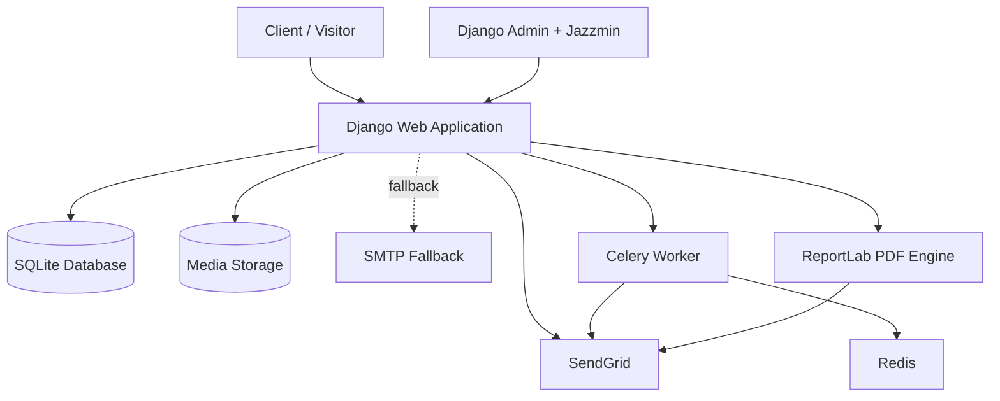
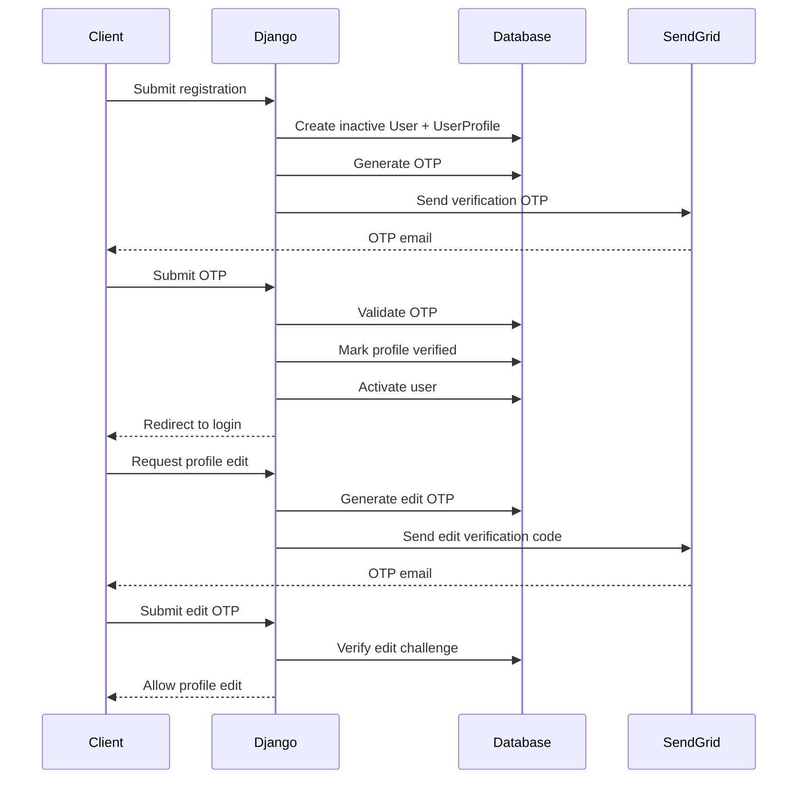
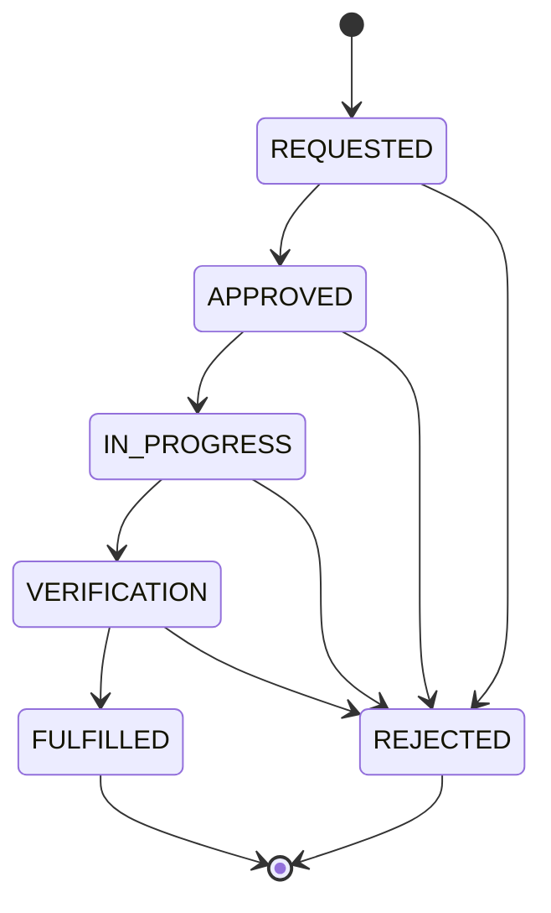
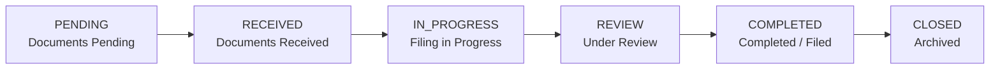
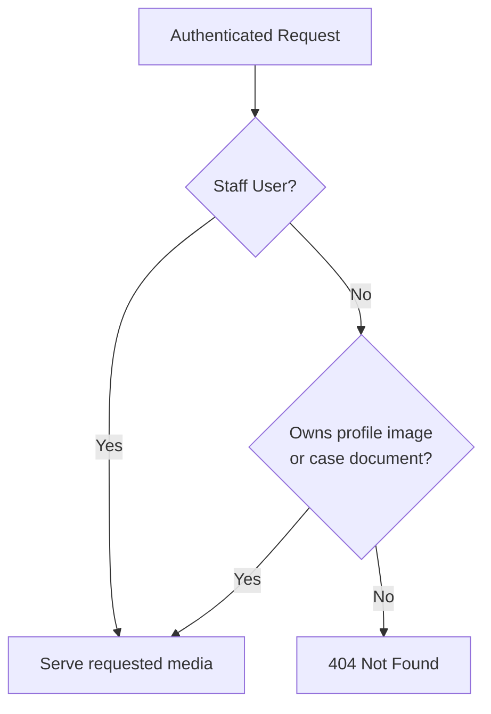
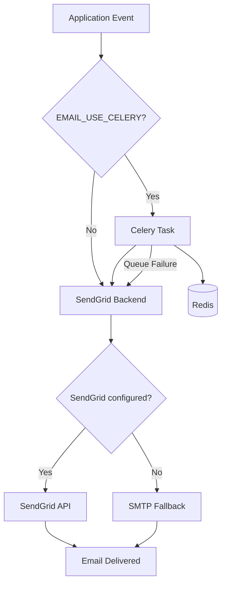
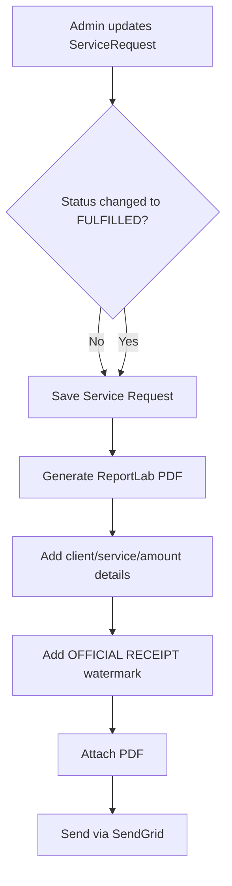

# Mishra Consultancy — Legal & Tax Management Platform

> A Django-based client and operations platform for Mishra Consultancy, combining legal-services intake, case/file management, taxation workflows, client document exchange, identity verification, automated notifications, and professional service receipts.

[](runtime.txt)
[](requirements.txt)
[](requirements.txt)
[](requirements.txt)
[](requirements.txt)
[](requirements.txt)
[](Procfile)

Mishra Consultancy is a server-rendered Django application designed around a simple operational pipeline:

**Inquiry → Client Account → Service Request → Active Case → Documents → Status Updates → Fulfilment → Receipt**

The platform provides separate client-facing workflows and staff/admin controls so the consultancy can manage incoming requirements while giving clients visibility into their requests and filings.

---

## Table of Contents

- [Overview](#overview)
- [Core Capabilities](#core-capabilities)
- [Service Areas](#service-areas)
- [System Architecture](#system-architecture)
- [Authentication & Identity](#authentication--identity)
- [Service Request Lifecycle](#service-request-lifecycle)
- [Case Management](#case-management)
- [Document Access Control](#document-access-control)
- [Email & Notification Architecture](#email--notification-architecture)
- [Automated Receipt Generation](#automated-receipt-generation)
- [Admin Command Center](#admin-command-center)
- [Technology Stack](#technology-stack)
- [Project Structure](#project-structure)
- [Configuration](#configuration)
- [Local Development](#local-development)
- [Production Deployment](#production-deployment)
- [Testing](#testing)
- [Security Model](#security-model)
- [Current Status](#current-status)
- [Roadmap](#roadmap)
- [Contributing](#contributing)
- [License](#license)

---

## Overview

Mishra Consultancy's platform digitizes the client-to-consultancy workflow without forcing clients to communicate every status change manually.

The application currently covers:

- Public consultation/inquiry intake
- Client registration and email OTP verification
- Secure profile editing with an additional OTP step
- Client service requests
- Legal/tax filing records
- Case assignment to legal professionals
- Client document uploads
- Case and service status tracking
- Payment/status visibility
- Automated email notifications
- PDF service receipts
- Staff and administrator management through Django Admin + Jazzmin

The application uses Django's built-in authentication/session framework and extends it with consultancy-specific profiles, identifiers, service requests, filings, and administrative controls.

---

## Core Capabilities

### 1. Client Identity & OTP Verification

New client accounts are created in an inactive state and verified through an email OTP before activation.

The platform also supports a second OTP checkpoint before profile changes are committed. This is used for sensitive account/profile modifications such as email and phone updates.

Client profiles receive a unique consultancy identifier using the format:

```text
MC-YYYY-NNNN
```

Example:

```text
MC-2026-0005
```

---

### 2. Client Service Intake

Authenticated clients can create service requests for:

- GST services
- Income Tax
- Legal Documentation
- Notary & Affidavit

A request begins in the `REQUESTED` state and can be progressed by staff through the operational lifecycle.

---

### 3. Case & Filing Management

Formal cases support:

- Case title and description
- Client association
- Lawyer assignment
- Filing status
- Amount due
- Payment status
- Invoice number
- Client notes
- Document upload
- Created/updated timestamps

Case progress is represented through a status-to-percentage mapping:

| Status | Progress |
|---|---:|
| Documents Pending | 10% |
| Documents Received | 30% |
| Filing in Progress | 60% |
| Under Review | 85% |
| Completed/Filed | 100% |
| Closed/Archived | 100% |

---

### 4. Automated Notifications

Email notifications are integrated into the application for important workflow events, including:

- Registration OTP
- Profile-change OTP
- Inquiry confirmation
- Admin inquiry notification
- Inquiry follow-up notification
- Service request status changes
- Case status changes
- Payment alerts
- Account creation/welcome notifications
- Service-fulfilment receipts

SendGrid is the primary provider, with SMTP available as a fallback when SendGrid is not configured.

---

### 5. Professional PDF Receipt Engine

When a service request transitions to `FULFILLED`, the application can:

1. Generate a branded A4 PDF.
2. Include the consultancy ID and client details.
3. Include the service description and recorded amount.
4. Add an `OFFICIAL RECEIPT` watermark.
5. Attach the generated PDF to an email.
6. Send the receipt to the client's registered email.

The PDF is generated in memory using ReportLab rather than requiring a separate document-generation service.

---

## Service Areas

The currently implemented service-request categories are:

| Category | Purpose |
|---|---|
| GST Services | GST-related service requests |
| Income Tax | Income-tax related services |
| Legal Documentation | Legal drafting/document workflows |
| Notary & Affidavit | Notary and affidavit services |

The public inquiry model additionally supports:

| Inquiry Area |
|---|
| Taxation (GST / Income Tax) |
| Contractor License / E-Tenders |
| Criminal Law / Litigation |
| Notary / Legal Drafting |
| General Inquiry |

---

# System Architecture



### Architectural Components

**Django application**

Handles routing, authentication, forms, models, business workflows, sessions, templates, and administration.

**Django Admin + Jazzmin**

Provides staff-facing management for clients, lawyers, inquiries, service requests, cases, and user access.

**SQLite**

The repository's current Django settings use SQLite as the database backend by default.

**SendGrid**

Primary transactional email provider.

**SMTP**

Fallback email path when a SendGrid API key is not configured and SMTP credentials are available.

**Celery + Redis**

Provides an optional asynchronous email path. The application also contains a synchronous fallback when queueing fails.

**ReportLab**

Generates service receipt PDFs in memory.

**WhiteNoise**

Serves compressed static assets from the Django deployment.

---

# Authentication & Identity



### Identity Controls

- Email is used as the login username.
- Newly registered accounts remain inactive until OTP verification.
- OTP resending is supported.
- Profile edits require an additional OTP challenge.
- Each profile receives a unique consultancy ID.
- Django password validation is enabled with the standard similarity, minimum length, common-password, and numeric-password validators.

---

# Service Request Lifecycle



A service request contains:

```text
Client
Service Type
Sub-service
Description
Status
Created At
Amount
Payment Status
```

When status changes, the system can notify the associated client by email.

When the request first reaches `FULFILLED`, the receipt workflow is triggered.

---

# Case Management



Cases can be managed from the staff/admin workflow and support:

- Client relationship
- Lawyer assignment
- Filing status
- Payment status
- Amount due
- Invoice number
- Client notes
- Document storage
- Progress percentage
- Automated status email

---

# Document Access Control

User-uploaded media is not exposed through an unrestricted public file path.

The application provides a protected media view that:

- Requires authentication.
- Rejects path traversal patterns.
- Allows staff to access uploads.
- Restricts normal clients to their own profile picture and their own case documents.



This is an application-level authorization layer for uploaded media; it should not be interpreted as a substitute for broader production infrastructure hardening.

---

# Email & Notification Architecture



The SendGrid integration includes:

- Configurable retry count
- Retry delay
- Detection of retryable HTTP failures such as `429` and `5xx`
- Non-retryable handling for sender/configuration errors
- Sender validation
- HTML and plain-text support
- CC/BCC support
- Reply-To support
- Base64 PDF/file attachment handling

The application also contains a Django deployment check that validates the configured sender when SendGrid is enabled.

---

# Automated Receipt Generation



Receipt information includes:

- Receipt number
- Issue date
- Consultancy ID
- Client name
- Registered contact
- Service description
- Recorded amount
- Computer-generated declaration

---

# Admin Command Center

The Django admin is customized with Jazzmin and acts as the main staff operations interface.

## User & Access Management

Administrators can:

- View user identity/profile information
- See consultancy IDs
- Distinguish client/staff/root access levels
- Suspend selected user accounts
- Restore user accounts
- View session-related activity information

## Service Request Management

Staff can:

- Search service requests
- Filter by service/status/payment
- Edit status directly from the list
- Enter service amounts directly from the list
- View finance status
- Manage the service lifecycle

## Case Management

Staff can:

- Search cases
- Filter by case/payment/lawyer
- Assign lawyers
- Update case status
- Update payment status
- Enter amount due
- View document availability
- Trigger payment-request emails

## Inquiry Management

The public consultation form creates an `Inquiry` record that staff can:

- Search
- Filter
- Update status
- Convert into a client account

The implemented conversion flow creates a Django user/profile and sends an account-creation email.

---

# Technology Stack

| Layer | Technology |
|---|---|
| Language | Python 3.11.9 |
| Framework | Django 5.0.4 |
| Application Server | Gunicorn |
| ASGI Server | Uvicorn |
| Static Files | WhiteNoise |
| Database | SQLite (current Django configuration) |
| Database Driver | psycopg2-binary included in dependencies |
| Background Jobs | Celery 5.4 |
| Queue/Broker | Redis 5.0.8 |
| Email | SendGrid 6.11 |
| Email Fallback | Django SMTP backend |
| PDF Generation | ReportLab 4.2.5 |
| Admin UI | Django Admin + Jazzmin 3.0.1 |
| Forms/UI Helpers | django-widget-tweaks, django-formtools |
| Phone Validation | django-phonenumber-field + phonenumbers |
| Image Processing | Pillow |
| QR Generation | qrcode |
| Production Platform | Render |
| Process Model | Gunicorn web process + optional Celery worker |

---

# Project Structure

```text
Law_Firm_Management_system_Django/
├── cases/
│   ├── admin.py
│   ├── apps.py
│   ├── checks.py
│   ├── forms.py
│   ├── models.py
│   ├── sendgrid_backend.py
│   ├── sendgrid_backend_v2.py
│   ├── tasks.py
│   ├── urls.py
│   ├── utils.py
│   ├── views.py
│   ├── migrations/
│   └── templates/
│       ├── base.html
│       ├── home.html
│       ├── cases/
│       ├── clients/
│       └── lawyers/
│
├── djangoProject/
│   ├── asgi.py
│   ├── celery.py
│   ├── settings.py
│   ├── urls.py
│   └── wsgi.py
│
├── templates/
│   ├── about.html
│   ├── services.html
│   ├── cases/
│   └── registration/
│
├── static/
│   ├── css/
│   ├── images/
│   └── js/
│
├── staticfiles/
├── media/
├── .env.example
├── Procfile
├── manage.py
├── requirements.txt
├── runtime.txt
├── SENDGRID_SETUP.md
├── SENDGRID_MIGRATION_SUMMARY.md
├── SENDGRID_QUICK_REFERENCE.md
└── README.md
```

---

# Configuration

Create a local `.env` file from `.env.example`.

## Core Django settings

```env
SECRET_KEY=replace-with-a-secret-value
DEBUG=False
```

For production, the secret key must be stored as an environment variable and must not be committed to source control.

## SendGrid

```env
SENDGRID_API_KEY=your-sendgrid-api-key
DEFAULT_FROM_EMAIL=your-verified-sender@example.com
SENDGRID_FROM_EMAIL=your-verified-sender@example.com
SENDGRID_FROM_NAME=Mishra Consultancy

EMAIL_SEND_RETRIES=3
EMAIL_RETRY_DELAY_SECONDS=2
SENDGRID_MAX_RETRIES=3
```

When SendGrid is enabled, the configured sender must match a verified SendGrid sender/domain.

## SMTP fallback

If SendGrid is not configured, the application can use SMTP when the following values are provided:

```env
EMAIL_HOST=smtp.example.com
EMAIL_PORT=587
EMAIL_USE_TLS=True
EMAIL_USE_SSL=False
EMAIL_TIMEOUT=30
EMAIL_HOST_USER=your-account
EMAIL_HOST_PASSWORD=your-password
```

## Celery / Redis

```env
REDIS_URL=redis://localhost:6379/0
CELERY_BROKER_URL=redis://localhost:6379/0
CELERY_RESULT_BACKEND=redis://localhost:6379/0
CELERY_TASK_ALWAYS_EAGER=False
EMAIL_USE_CELERY=False
```

Set `EMAIL_USE_CELERY=True` when the deployment is configured to use the Celery worker for email jobs.

## Media storage

The application reads `MEDIA_ROOT` from the environment and defaults to:

```text
media/
```

For a persistent production filesystem, configure a suitable storage location such as:

```env
MEDIA_ROOT=/var/data/media
```

---

# Local Development

## 1. Clone the repository

```bash
git clone https://github.com/<your-username>/<your-repository>.git
cd Law_Firm_Management_system_Django
```

## 2. Create a virtual environment

```bash
python3.11 -m venv venv
source venv/bin/activate
```

## 3. Install dependencies

```bash
pip install -r requirements.txt
```

## 4. Configure environment variables

```bash
cp .env.example .env
```

Then configure the required values.

## 5. Apply migrations

```bash
python manage.py migrate
```

## 6. Create an admin account

```bash
python manage.py createsuperuser
```

## 7. Collect static files

```bash
python manage.py collectstatic
```

## 8. Start the development server

```bash
python manage.py runserver
```

The application will normally be available at:

```text
http://127.0.0.1:8000/
```

---

# Production Deployment

The repository includes a `Procfile` with two process types:

```procfile
web1: gunicorn djangoProject.wsgi --log-file -
worker: celery -A djangoProject worker --loglevel=info --pool=solo
```

The web process runs the Django application through Gunicorn.

The worker process runs Celery for asynchronous tasks when the queue-based email path is enabled.

## Production checklist

Before deploying:

- Set a strong `SECRET_KEY`.
- Set `DEBUG=False`.
- Configure `CSRF_TRUSTED_ORIGINS` for the production domain.
- Configure a verified SendGrid sender/domain.
- Configure the production email credentials.
- Configure Redis when using Celery.
- Configure persistent media storage for uploaded documents/profile images.
- Do not commit `.env` or provider credentials.
- Run Django checks before release.
- Keep database and media backups appropriate to your deployment.

---

# Testing

The repository includes tests covering core integration points, including:

- SendGrid sender validation
- Non-retryable SendGrid error handling
- Inquiry creation
- Client/admin inquiry email dispatch
- Inquiry persistence when email delivery fails
- Invalid inquiry email rejection
- Protected profile-photo access
- Cross-client media access denial

Run the test suite with:

```bash
python manage.py test
```

Run Django checks with:

```bash
python manage.py check
```

Check for unapplied migration changes with:

```bash
python manage.py makemigrations --check --dry-run
```

---

# Security Model

The project uses Django's authentication and security middleware together with application-level access controls.

### Authentication

- Django authentication/session framework
- Email-based username convention
- Inactive account state before OTP verification
- Registration OTP
- Profile-edit OTP challenge
- Standard Django password validators

### Request Protection

Django's configured middleware includes:

- `SecurityMiddleware`
- `CsrfViewMiddleware`
- `XFrameOptionsMiddleware`
- `AuthenticationMiddleware`
- `SessionMiddleware`

Secure session and CSRF cookies are enabled in the current production-oriented configuration.

### Uploaded Media

Uploaded media is served through an authenticated route with ownership checks for non-staff users.

### Email Configuration Safety

The SendGrid backend:

- Validates the sender when an API key is configured.
- Rejects known placeholder sender values.
- Distinguishes retryable provider failures from non-retryable configuration errors.
- Supports bounded retry attempts.

### Important Security Considerations

This repository implements application-level controls, not a guarantee of complete system security.

Production hardening should also include:

- Secret rotation and secure secret storage
- Persistent database backups
- Persistent and access-controlled media storage
- Restrictive production host configuration
- Provider-level email/domain authentication
- Monitoring and logging
- Regular dependency updates
- HTTPS enforcement at the deployment layer
- Principle-of-least-privilege access to the admin interface

---

# Current Status

**Status: Deployed and operational**

Current repository capabilities include:

- Client registration and OTP verification
- Secure profile-edit verification
- Public inquiry intake
- Client onboarding/conversion workflow
- Service requests
- Legal/tax case management
- Lawyer directory and assignment
- Document upload and protected document access
- Payment status and manual amount management
- Automated transactional email
- Celery/Redis integration
- ReportLab receipt generation
- Django Admin + Jazzmin command center
- Render deployment configuration

The project is actively evolving, with recent commits focused on email delivery, SendGrid migration, and profile-photo handling.

---

# Roadmap

The following are potential future improvements rather than claims of current functionality:

- [ ] Dedicated client-facing service-request management UI beyond the current filing flow
- [ ] Richer case timelines and document history
- [ ] PostgreSQL as the default production database configuration
- [ ] Object storage for long-term document retention
- [ ] Automated payment-gateway integration
- [ ] Audit logging for sensitive administrative actions
- [ ] Role-specific staff permissions beyond Django's standard staff/superuser model
- [ ] Improved notification preferences
- [ ] Expanded automated test coverage
- [ ] API layer for integrations/mobile clients
- [ ] Observability and application metrics

---

# Contributing

Contributions, fixes, and improvements are welcome.

For a change:

1. Create a feature branch.
2. Keep changes focused and backwards-compatible.
3. Add or update tests where appropriate.
4. Run:

```bash
python manage.py check
python manage.py test
python manage.py makemigrations --check --dry-run
```

5. Open a pull request describing the change and any deployment/configuration implications.

Please do not commit:

- `.env` files
- API keys
- SMTP passwords
- production secrets
- private client documents
- generated production media

---

# License

No explicit open-source license is currently declared in the repository.

Until a license file is added, the source should not be assumed to grant broad permission to copy, modify, redistribute, or commercially reuse the code.

---

## Project Philosophy

Mishra Consultancy is designed around a practical principle:

> **Make complex legal and taxation workflows easier to manage for the consultancy and easier to understand for the client.**

The system connects operational administration, client visibility, document handling, status communication, and service completion into one Django application.

---

## Built With

**Django · Python · Celery · Redis · SendGrid · ReportLab · Jazzmin · Bootstrap · Gunicorn · Render**

